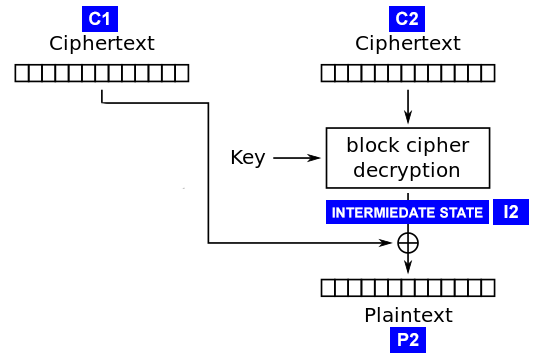

# Right Foot Two Stomps
__Category__: Crypto   
__Points__: 200  

> Welcome to the AES-CBC oracle!   
> Our oracle's function is AES-CBC.   
> The oracle is found at umbccd.io:13372, and your methods are:   
> - flg - returns the encrypted flag   
> - enc - returns the encryption of the message after the : in "enc:..."   
>          as 16 bytes of initialization vector followed by the ciphertext.   
> - dec - returns the decryption of the ciphertext after the : in "dec:<16 bytes iv>..."   
>          as a bytes string.   
>     
> \@author: pleoxconfusa   

### Overview
Using `enc` we get that the IV is
```python
b'p]\xb2\x97\x15\x9cK\xaf!\xd6\x82_N\xe2]]'
```
and `flg` yields
```python
b"\xe7\x10\x98\x8f_\xb3Zi#8[2\xd4\x8a'-\xf8\xf3\xa2\x96&\xfc}\x8a\xb0\x8d\xd7\x17_\nR!.\xb5\x80\xf4\x16\x9e Us\x10\n\xc7\xa8bE\xfc"
```
The IV is 16 bytes long, so we are dealing with AES128.
Decrypting the flag directly obviously doesn't work, we get a  
```
Nice try.
```
so we have to find a different way.
Trying out different padding formats in the `dec` method yields that the oracle uses
the [PKCS#7](https://en.wikipedia.org/wiki/Padding_(cryptography)#PKCS#5_and_PKCS#7) padding scheme
and that it gives the user feedback whether the padding was valid (immediate response) or not valid (no response, infinite wait time with `recv()`).
This led me to try out a slightly simplified version of a [padding-oracle attack](https://robertheaton.com/2013/07/29/padding-oracle-attack/) on PKCS#7.


### The attack
   
Above you can see how decryption works in CBC mode. Note that `C2`
denotes in our case the last 16 bytes of the ciphertext and `P2` the last 16
characters of the plaintext.
Since `P2` is the last block, the decryption software goes ahead and looks at the last byte
of `P2` determining the padding in use. Let's say the value of the last byte is `n`.
The oracle then checks whether the last `n` bytes are all equal to `n`, trunactes the
plaintext to `len(P1 + P2) - n` bytes and sends the truncated plaintext back as the response (this is the 
PKCS#7 part).
We now use a typical padding-orcale attack-setup where `C1` is a specifically crafted block 
and `C2` is a block of the ciphertext.

If we could arrange that the last byte of `C1` XORed with the last byte of `I2` equals `0x1` we would
have a valid plaintext with a padding of 1 byte. The plaintext would consist of 16 bytes garbage (decryption
of `C1`) and 15 bytes of the stuff we care about (decryption of `C2`).
Here `C1` must always be the block previous to the one we send as `C2`. It must be the IV when we send the first
block as `C2`, it must be the first block if we send the second block as `C2` and so on.
Note that we only change the last byte of the otherwise valid previous block.

By repeating this technique with every block of the ciphertext we get the decrypted message - mostly.
Unfortunately this only yields 15/16 of the plaintext.
So how can we recover the last byte? Well we use the same method as the
padding-oracle attack to recover the plaintext byte. We know that `C1[15] ^ I2[15] == 0x1` so we also know that
`I2[15] == 0x1 ^ C1[15]` (quick maths). We now take the last byte of the previous block (the real one not our faked one) and XOR that with the
leaked value of `I2[15]`. This replays the 'normal' decryption process and we get the plaintext byte.

Only one problem left: How do we arrange that `C1[15] ^ I2[15] == 0x1`? Well...we just bruteforce it.

### Profit
[solve.py](./solve.py) implements the attack described above and we get the flag
```
DawgCTF{!_Th0ugh7_Th3_C!ph3rt3x7_W@s_Sh0rt3r.}
```
