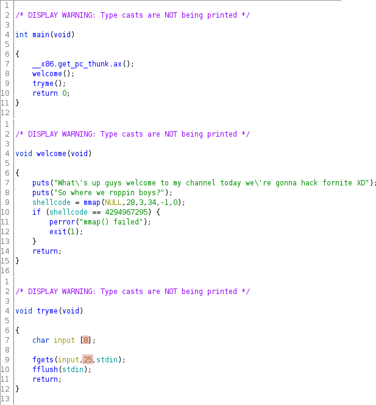

# Where we roppin boys?
__Category__: Pwn   
__Points__: 350  

> Forknife is still a thing right?
>
> nc ctf.umbccd.io 4100  
>
> Author: trashcanna
>
> Attachement: [rop](./rop)

### Overview
We were given a 32-bit executable with canaries and PIE disabled.  
The main functionality of the binary includes only 3 small functions:   
   
The vulnerability is highlighted in red. `tryme` stores up to 25 bytes   
into an 8-byte buffer leading to a classical stack-buffer overflow.   
Unfortunately 25 bytes allow only very limited exploitation, in fact  
if we look at the stackframe of `tryme` the overflow allows us to place  
a maximum of only 2 ROP-gadgets.   
   
   
Stackframe of `tryme`:   
| Offset  | Content        | Size | 
|--------|----------------|------|
| -0x4   | Return pointer | 4    |
| -0x8   | Saved ebp      | 4    |
| -0xc   | Saved ebx      | 4    |
| -0x14  | input          | 8    |

### Hidden Functionalities
Looking at the symbol table we can see that the binary contains a lot of functions   
that don't get called:   


The first 7 functions set the shellcode up, which was mmaped earlier in `welcome`.   
Each of these functions appends 4 specific bytes to the shellcode.    
The last function `win` takes the shellcode and executes it.  
After puzzling a bit we can get the following shellcode
```
0:    31 c0                   xor    eax, eax
2:    50                      push   eax
3:    68 2f 2f 73 68          push   0x68732f2f
8:    68 2f 62 69 6e          push   0x6e69622f
d:    89 e3                   mov    ebx, esp
f:    89 c1                   mov    ecx, eax
11:   89 c2                   mov    edx, eax
13:   b0 0b                   mov    al, 0xb
15:   cd 80                   int    0x80
17:   31 c0                   xor    eax, eax
19:   40                      inc    eax
1a:   cd 80                   int    0x80
```
with the following order:
1. tilted_towers
2. junk_junction
3. snobby_shores
4. greasy_grove
5. lonely_lodge
6. dusty_depot
7. loot_lake

So our task is to create a ROP-chain that calls these 7 functions  
in exactly that order followed by a call to `win` to get a shell.   
But we can place only 2 ROP-gadgets so how do we execute 8?

### Expanding our possibilities
If we take a look at the disassembly of `main`:

We can see that a `CALL tryme` follows an `AND ESP, 0xfffffff0`.  
If we take the stackframe of `tryme` from above and add some stack  
addresses we get the following stack layout (where *x* stands for a random byte):

| Address    | Offset  | Content           | Size |
|------------|--------|-------------------|------|
| *xxxxxxx*0 | -0x0   | Aligned by `main` |      |
| *xxxxxxx*C | -0x4   | Return pointer    | 4    |
| *xxxxxxx*8 | -0x8   | Saved ebp         | 4    |
| *xxxxxxx*4 | -0xc   | Saved ebx         | 4    |
| *xxxxxxx*0 | -0x10  | input + 4         | 4    |
| *xxxxxxx*C | -0x14  | input + 0         | 4    |

If we now overwrite the return pointer of `tryme` with the address  
of `main` (0x08049714) we can cause a second alignment, this time at address  
*xxxxxxx*C moving the stack pointer all the way down to `input + 4` preserving  
everything else in `tryme`'s stackframe.  
After that `main` calls `tryme` again overwriting `input + 0` with the return  
address for `tryme`.   
We then have *again* the possibility to do a buffer-overflow.  
If we repeat this we can allocate multiple stackframes.
This is the setup for our ROP-chain.

### Crafting an exploit
The exploit strategy is to create the following stack layout  
by repeatedly calling main through the buffer-overflows:

| Offset | Stackframe Layout          | Size | ROP-gadget       |  Nesting Level |
|--------|----------------------------|------|------------------|----------------|
| -0x0   | Aligned by `main`          | 4    | __win()__          | main           |
| -0x4   | Return pointer             | 4    | main()           | 1. tryme       |
| -0x8   | Saved ebp                  | 4    | *garbage*        | 1. tryme       |
| -0xC   | Saved ebx                  | 4    | pop ebx; pop ebp | 1. tryme       |
| -0x10  | input + 4                  | 4    | *garbage*        | 1. tryme       |
| -0x14  | input + 0 / Return Pointer | 4    | main()           | 1./2. tryme    |
| |
| -0x18  | Saved ebp                  | 4    | pop ebx; pop ebp | 2. tryme       |
| -0x1C  | Saved ebx                  | 4    | __dusty_depot()__    | 2. tryme       |
| -0x20  | input + 4                  | 4    | *garbage*        | 2. tryme       |
| -0x24  | input + 0 / Return Pointer | 4    | main()           | 2./3. tryme    |
| |
| -0x28  | Saved ebp                  | 4    | pop ebx; pop ebp | 3. tryme       |
| -0x2C  | Saved ebx                  | 4    | __lonely_lodge()__   | 3. tryme       |
| -0x30  | input + 4                  | 4    | *garbage*        | 3. tryme       |
| -0x34  | input + 0 / Return Pointer | 4    | main()           | 3./4. tryme    |
| ...    | ...                        | ...  | ...              | ...            |
| -0x74  | input + 0 / Return Pointer | 4    | pop ebx          | 7./8. tryme    |
| -0x78  | Saved ebp                  | 4    | *garbage*        | 8. tryme       |
| -0x7C  | Saved ebx                  | 4    | *garbage*        | 8. tryme       |
| -0x84  | input                      | 8    | *garbage*        | 8. tryme       |

Note how here the last function before `win` is `dusty_depot` and not `loot_lake`   
because if you leave out the last 4 bytes of the shellcode you still get a valid   
execve() and this makes the ROP-chain a bit shorter.

### Profit
[exploit.py](./exploit.py) executes the exploit as described above and we get
```
DawgCTF{f0rtni9ht_xD}
```
